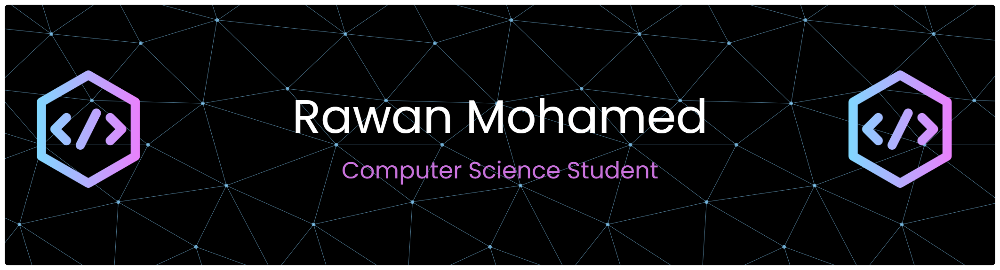

<!--Banner--> 
 

<!--Header Name--> 
# Hi, I’m Rawan 

<!--Intro--> I’m a Computer Science student focused on software development, with an interest in turning ideas into practical solutions through applied problem-solving. 
<ul>🎓 Computer Science student</ul>
<ul>🌱 Developing programming fundamentals</ul>
📍 Based in the UAE

<!--Projects Section--> 
<h2 align="center">📂 Projects</h2> 
<ul align="left"> 
  <li>University assignments</li> 
  <li>Practice coding projects</li> 
  <li>Personal projects</li> 
</ul> 
<i>More projects will be added as I continue growing 🚀</i>

<!--Current Goals--> 
<h2 align="center">🎯 Current Goals</h2> 
<ul align="left"> 
  <li>Improve coding consistency</li> 
  <li>Build small but complete projects</li> 
  <li>Strengthen understanding of core CS concepts</li> 

</ul><!--Coding Languages--> 
<h2 align="center">💻 I Code With...</h2> 

 
   
   
   
   
   

 --- <!--Contact Section--> 
<h2 align="center">🤝 Contact Me</h2> 

 
   
 
  
  
<!--Quote--> 
<h2 align="center">🌟 Thought of the Day</h2> 
 
   
 --- <!--Footer--> 
  
  

